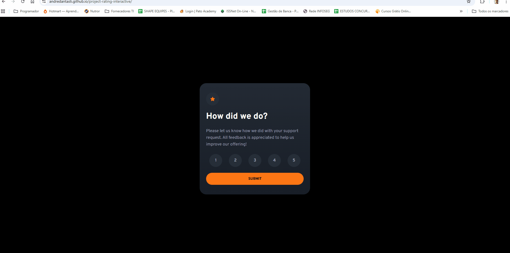

# ⭐ Project Rating Interactive

[](LICENSE)
[](#)
[](https://github.com/andredantasti/project-rating-interactive/stargazers)
[](https://github.com/andredantasti/project-rating-interactive/issues)

> Um componente interativo de avaliação desenvolvido com **HTML**, **CSS** e **JavaScript puro**.

---

## 🚀 Como Executar Localmente

```bash
# 1. Clone o repositório
git clone https://github.com/andredantasti/project-rating-interactive.git

# 2. Entre na pasta do projeto
cd project-rating-interactive

# 3. Abra o arquivo index.html no navegador

```
Escolha uma nota, clique em Submit e veja o resultado na tela de agradecimento.

🔧 Melhorias Futuras

Adicionar suporte a teclado e acessibilidade (ARIA)

Criar animações mais elaboradas (ex: fade ou pulse na seleção)

Armazenar notas em um backend (Node.js ou Firebase)

Converter o componente para React ou Web Component reutilizável

Adicionar testes automatizados com Jest/Cypress

🖼️ Exemplo Visual




📚 Aprendizados

Durante o desenvolvimento deste projeto, foram aprimorados conceitos fundamentais de JavaScript e DOM, como:

Manipulação de eventos (addEventListener)

Uso de classList para alternar estados de elementos

Leitura e escrita com localStorage

Separação de responsabilidades em arquivos JS distintos

Fluxo de dados entre páginas HTML

📜 Licença

Distribuído sob a MIT License.
Veja o arquivo LICENSE
 para mais detalhes.

📬 Contato

André Alexandre Moreira Dantas
💻 GitHub

🌐 Portfólio

📧 Em breve — contato profissional